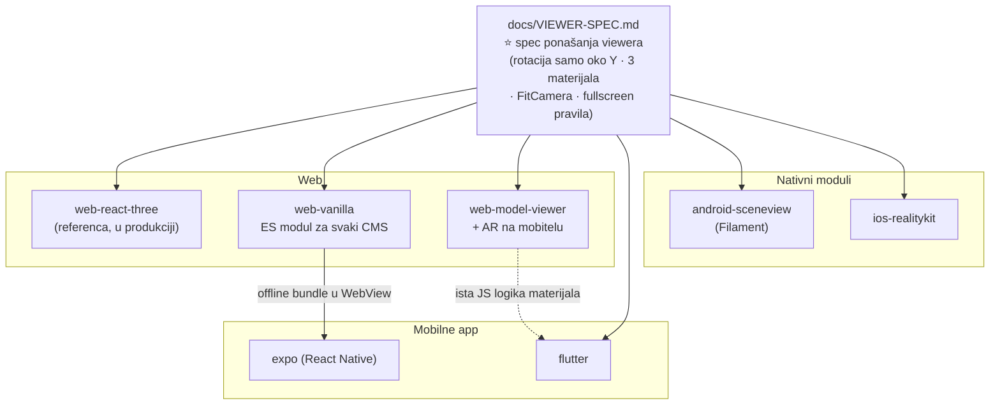
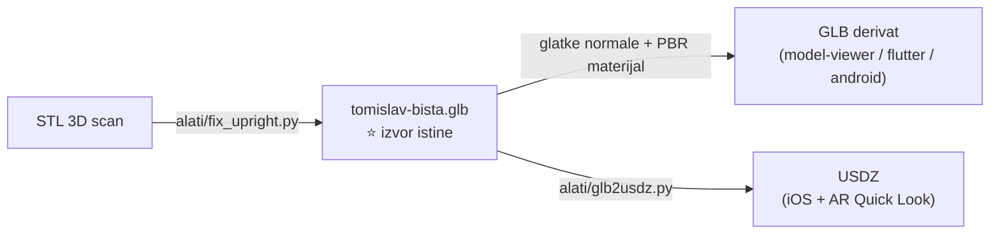

# DBHZ 3D modeli — digitalni muzej

Katalog 3D modela kulturne baštine Družbe „Braća Hrvatskoga Zmaja" (DBHZ) +
**referentne implementacije 3D viewera u više tehnologija**. Cilj: svaki model
iz kataloga može se pregledavati kao u muzeju (rotacija oko vertikalne osi,
varijante materijala, fullscreen), a viewer se može **doslovno prekopirati u
bilo koju postojeću aplikaciju** — web, Expo/React Native, Flutter, nativni
Android (Kotlin) ili iOS (Swift).

Sve ovdje je već **isprobano i radi u produkciji** u DBHZ novčanik prototipu
([dbhz-prototip.domovina.ai](https://dbhz-prototip.domovina.ai), ekran „Bista") —
ovaj repo je destilacija toga u samostalan, prenosiv oblik.

**Javni katalog:** [dbhz-3d-modeli.domovina.ai](https://dbhz-3d-modeli.domovina.ai)
(`katalog/`, Vite + Cloudflare Workers; novi model = folder u `modeli/` + unos u
`modeli/katalog.json`).

## Struktura

| Putanja | Sadržaj |
|---|---|
| `modeli/` | katalog modela (GLB = izvor istine; po modelu README s metapodacima; `katalog.json` = podaci za javni katalog) |
| `katalog/` | javni katalog 1..N modela na [dbhz-3d-modeli.domovina.ai](https://dbhz-3d-modeli.domovina.ai) |
| `alati/fix_upright.py` | pipeline STL scan → uspravan, normaliziran GLB (trimesh) |
| `referentna-implementacija/web-react-three/` | **provjerena** web implementacija (Vite + React 18 + three.js + R3F) — izvor ponašanja za sve ostale |
| `docs/VIEWER-SPEC.md` | ⭐ tehnološki neutralan spec ponašanja viewera — ovo se portira, ne kod |
| `docs/00-pregled-tehnologija.md` | analiza i preporuke tehnologija (stanje: srpanj 2026.) |
| `docs/01…05-*.md` | planovi implementacije po tehnologiji |
| `docs/3d-bista-tehnicki-vodic.md` | dubinski tehnički vodič (kako je sve izvedeno + naučene lekcije) |
| `implementacije/<ime>/` | portovi VIEWER-SPEC-a po tehnologiji (status: `docs/STATUS.md`) |

## Implementacije

| Implementacija | Tehnologija | Status |
|---|---|---|
| `referentna-implementacija/web-react-three` | Vite + React 18 + three.js + R3F | ✅ radna referenca |
| `katalog` | Vite + vanilla three.js, Cloudflare Workers (static assets) | ✅ verificirano · 🌐 [uživo](https://dbhz-3d-modeli.domovina.ai) |
| `implementacije/web-vanilla` | vanilla three.js ES modul (bez Reacta) | ✅ verificirano |
| `implementacije/web-model-viewer` | Google `<model-viewer>` | ✅ verificirano |
| `implementacije/expo` | Expo / React Native (WebView reuse) | ✅ verificirano (web + fizički Android + iOS simulator) |
| `implementacije/flutter` | Flutter + `model_viewer_plus` | ✅ verificirano (web + fizički Android + iOS simulator) |
| `implementacije/android-sceneview` | Kotlin + Compose + SceneView (Filament) | ✅ verificirano (fizički Android) |
| `implementacije/ios-realitykit` | SwiftUI + RealityKit | ✅ verificirano (iOS simulator) · 📱 geste čekaju uređaj |

Detalji (verzije, kako pokrenuti, kako testirano): [`docs/STATUS.md`](docs/STATUS.md) ·
cjelovit izvještaj s vizualizacijama: [`docs/IZVJESTAJ.md`](docs/IZVJESTAJ.md).

## Kako dijelovi stoje u odnosu

Portira se **spec ponašanja**, ne kod — a implementacije dijele stvarne artefakte:



Jedan model pokreće sve — derivati se generiraju skriptama iz repoa:



## Brzi start (referentna web implementacija)

```bash
cd referentna-implementacija/web-react-three
npm install && npm run dev
```

## Kako dodati novi model u katalog

1. Skeniraj / nabavi STL ili glTF izvor.
2. `python3 alati/fix_upright.py` (prilagodi `SRC`/`OUT`) — decimacija, geometrijsko
   uspravljanje (detekcija ravnog dna postolja), centriranje, normalizacija na 2 jedinice.
3. Spremi u `modeli/<ime>/<ime>.glb` + `README.md` s metapodacima (izvor, autor,
   licenca, provjerene činjenice vs. ilustrativno).
4. Viewer radi out-of-the-box — sve implementacije očekuju Y-up, centriran,
   ~2 jedinice visok GLB bez tekstura (materijal se zadaje programski).

## Licenca i atribucija — ⚠️ pročitaj prije objave

- Kod je predviđen kao 100% open source (licenca TBD — prijedlog MIT).
- **Ime, grb i modeli DBHZ-a nisu obuhvaćeni licencom koda** — za javnu produkcijsku
  upotrebu potrebna je suglasnost Družbe.
- Atribucija skulpture biste kralja Tomislava **nije potvrđena** (dokumentirana povijesna
  bista: Stari grad Ozalj, 1933., Robert Frangeš Mihanović) — do potvrde tretirati kao
  ilustrativnu 3D digitalizaciju. Detalji u `modeli/tomislav-bista/README.md`.
