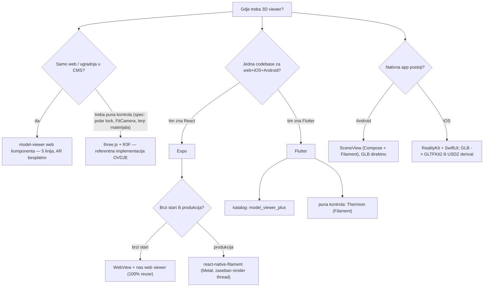
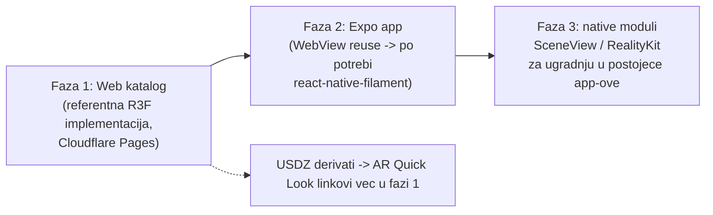

# Pregled tehnologija za 3D model viewer — analiza i preporuke

*Stanje: 2026-07-10. Cilj: digitalni muzej DBHZ — katalog GLB modela s viewerom
prema [`VIEWER-SPEC.md`](VIEWER-SPEC.md), kao starting point koji se kopira u
postojeće aplikacije.*

## TL;DR preporuke

| Platforma | Preporuka (2026) | Zašto |
|---|---|---|
| **Web** | three.js + React Three Fiber (imamo provjereno) ili `<model-viewer>` za najbrži katalog | R3F kod već radi 100%; model-viewer je 5 linija HTML-a ali manje kontrole |
| **Expo (web+iOS+Android)** | **react-native-filament** za produkciju; WebView s našim web viewerom kao pragmatičan start | expo-gl + R3F ima poznate verzijske sukobe (Expo SDK 53: expo-gl@15 vs R3F očekuje @11) i koristi deprecated OpenGL ES na iOS-u |
| **Flutter** | `model_viewer_plus` za katalog (WebView oko `<model-viewer>`); **Thermion** (Filament) za punu kontrolu | Thermion je jedini ozbiljan native-render put; flutter_scene još eksperimentalan |
| **Android nativno** | **SceneView** (Jetpack Compose + Filament) | Compose-native, GLB direktno, aktivno održavan (zadnji release 6/2026), ima llms.txt + MCP |
| **iOS nativno** | **RealityKit + SwiftUI** (`RealityView`/`Model3D`); GLB kroz **GLTFKit2** ili konverzija u USDZ | SceneKit službeno soft-deprecated (WWDC 2025) — ne počinjati novo na njemu |

## Stablo odluke

## Ključni uvidi koji vrijede za SVE platforme

1. **GLB je izvor istine** — svaka platforma ga čita: web/three.js nativno,
   Filament (RN, Flutter/Thermion, SceneView) nativno, RealityKit kroz GLTFKit2
   ili USDZ konverziju. Model bez tekstura + programski materijal = trivijalan
   port materijala (3 PBR broja po varijanti).
2. **Rotacija „na stolu"**: na webu se radi ograničenjem orbit-kamere
   (`minPolarAngle === maxPolarAngle`); na nativnim engine-ima je često
   jednostavnije **rotirati model oko Y osi s fiksnom kamerom** — identičan
   rezultat, spec dopušta oboje.
3. **Filament je zajednički nazivnik native rendera** (react-native-filament,
   Thermion, SceneView) — PBR parametri iz VIEWER-SPEC-a mapiraju se 1:1
   (baseColor / metallic / roughness).
4. **Fullscreen overlay uvijek na root razini** (portal / modalni route) —
   nikad fixed unutar dubine stabla (containing block bug, naučeno na iOS-u).
5. **AR kao bonus**: GLB → Android Scene Viewer intent; USDZ → iOS AR Quick Look.
   `<model-viewer>` i model_viewer_plus to daju besplatno.

## Matrica usporedbe

| Kriterij | Web R3F | model-viewer | Expo WebView | Expo RN-Filament | Flutter mvp+ | Flutter Thermion | SceneView | RealityKit |
|---|---|---|---|---|---|---|---|---|
| Trud do prvog rendera | ✅ gotovo | ✅ minute | ✅ sati | 🟡 dani | ✅ sati | 🟡 dani | 🟡 1–2 dana | 🟡 dani |
| Reuse našeg koda | 100% | spec | 100% | spec+mat. | spec | spec+mat. | spec+mat. | spec |
| Polar-lock + FitCamera + lerp | ✅ | 🟡 djelomično* | ✅ | ✅ | 🟡* | ✅ | ✅ | ✅ |
| Performanse na mobitelu | 🟡 WebGL | 🟡 WebGL | 🟡 WebGL | ✅ Metal/Vulkan | 🟡 WebView | ✅ | ✅ | ✅ |
| AR out-of-the-box | ➖ | ✅ | ➖ | ➖ | ✅ | 🟡 | ✅ (ARCore) | ✅ (Quick Look) |
| Rizik održavanja 2026 | nizak | nizak | nizak | nizak–srednji | srednji (WebView) | srednji | nizak | nizak |

\* `<model-viewer>` ima camera-orbit ograničenja i material API, ali animirani
prijelaz materijala i naš FitCamera zahtijevaju custom kod — izvedivo, ali se
gubi glavna prednost (jednostavnost).

## Strategija za DBHZ digitalni muzej (prijedlog faza)

Faza 1 je praktički gotova (ovaj repo). Svaka sljedeća faza portira
**VIEWER-SPEC**, ne kod.

## Izvori (provjereno 2026-07-10)

- [react-native-filament (Margelo)](https://github.com/margelo/react-native-filament) — Metal na iOS-u, render izvan JS threada
- [Stanje R3F + Expo](https://trifonstatkov.medium.com/the-current-state-of-using-react-three-fiber-in-react-native-expo-c65918593eaf) — expo-gl verzijski sukobi (SDK 53)
- [model_viewer_plus](https://pub.dev/packages/model_viewer_plus) · [Thermion](https://thermion.dev/) (Flutter + Filament)
- [WWDC 2025: SceneKit deprecation → RealityKit](https://dev.to/arshtechpro/wwdc-2025-scenekit-deprecation-and-realitykit-migration-a-comprehensive-guide-for-ios-developers-o26)
- [GLTFKit2](https://github.com/warrenm/GLTFKit2) — glTF za RealityKit/SceneKit/visionOS
- [SceneView](https://github.com/sceneview/sceneview) — Compose-native 3D (Filament), release 6/2026
- [Jetpack XR: Add 3D models](https://developer.android.com/develop/xr/jetpack-xr-sdk/add-3d-models)
