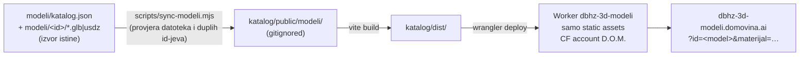

# Javni katalog 3D modela (2026-09-26)

Katalog je uživo na **https://dbhz-3d-modeli.domovina.ai** (kod u `katalog/`,
upute za pokretanje i dodavanje modela u `katalog/README.md`). Ovaj dokument
bilježi ono što se ne vidi iz koda: zašto je napravljen ovako, što je odbačeno
i koje su zamke koštale vremena.

## Tok podataka

## Odluke

| Odluka | Izabrano | Odbačeno i zašto |
|---|---|---|
| Framework | Vite + vanilla JS | React (referentna impl.) — `web-vanilla` je već bio čist ES modul po specu; React bi dodao ~140 KB i drugu kopiju viewer logike. Uzor zagreb.lol/zgrade/modeli također nema framework. |
| Hosting | Worker sa static assetsima | Pages — Cloudflare ga više ne preporučuje za nove projekte; Worker kasnije dopušta API bez migracije. |
| Domena | `dbhz-3d-modeli.domovina.ai` | `modeli.` (može značiti LLM modele) i `3d-modeli.` (3D modeli bilo čega, npr. namještaja). Korisnik želi „dbhz“ u imenu. `3d-modeli` je bio živ nekoliko minuta i wrangler ga je uklonio pri promjeni rute. |
| Podaci | jedan `modeli/katalog.json` | podaci po modelu u zasebnim JSON-ima — kod 1..N modela jedan fajl je pregledniji, a build ga validira. |
| Materijali | ključevi iz `SPEC.variants` u vieweru, katalog ih samo referencira | hexovi u katalogu — spec vrijednosti moraju ostati u jednoj strukturi (CLAUDE.md). Model bez `materijali` zadržava materijale iz GLB-a. |
| AR na Androidu | nije uključen | Scene Viewer bi dobio izvorni GLB bez materijala i normala. Rješenje je derivat iz `implementacije/web-model-viewer/` (ima normale i materijal), ali to treba provjeriti na uređaju. |

## Mjerenja (pravi Chrome, chrome-devtools MCP)

- Desktop 1440×900 (viewer 800×828): polar 82.00°, FitCamera 3.999 = formula
  (`dims` 1.412 × 2 × 1.137).
- Portret (prozor 500×828 jer Chrome ne ide uže): nativni fullscreen na `#viewer`,
  refit na 5.855. Overlay fallback: portal u `body`, klon scene, `overflow:hidden`,
  pa Escape vraća `inline`.
- Landscape 844×390: projicirani model u NDC y −0.834…0.848, x −0.364…0.391.
- Prijelaz kamen → bronca, metalness svakih 150 ms: 0.39, 0.58, 0.68, 0.73, 0.76 … 0.78.
- Bundle: JS 588 KB (150 KB gzip), gotovo sve three.js. GLB 1.4 MB, USDZ 4.7 MB.

## Zamke

1. **Nova poddomena ne rezolvira se lokalno** (curl exit 6) iako Cloudflare
   DNS već radi, jer lokalni resolver kešira negativan odgovor. Provjera:
   `dig +short <host> @1.1.1.1`, pa `curl --resolve <host>:443:<ip>`.
2. **Edge treba ~20 s nakon `wrangler deploy`.** Odmah nakon deploya `og.jpg`
   je vraćao 404, a HTML je još bio star.
3. **Test overlay fallbacka u Chromeu**: nije dovoljno obrisati
   `requestFullscreen`, jer viewer tada ode na `webkitRequestFullscreen`. Treba
   obrisati oba.
4. **wrangler i više accounta**: bez `account_id` u `wrangler.jsonc`
   neinteraktivni wrangler pada („More than one account available“). Account
   D.O.M. = `7dc7167b7e2e00923bfa7cd697df14e4`, na kojem je i zona `domovina.ai`.
5. **chrome-devtools `take_screenshot` s `filePath`** smije pisati samo unutar
   workspace roota (repo), ne u `/tmp` scratchpad.
6. `h()` helper u `main.js`: `podaci` su niz parova, pa djeca moraju ići kroz
   `flat(Infinity)`. S `flat()` se ispisivao `[object HTMLElement]`.

## Otvoreno

- AR Quick Look (USDZ) i dodirne geste treba provjeriti na fizičkom iPhoneu.
  Android nije bio spojen, pa ni tamo nema provjere dodirom.
- Atribucija biste i licenca modela još nisu potvrđene (u UI-ju stoje kao
  „nepotvrđeno“ i „još nije utvrđena“).
- Android AR preko derivata GLB-a (v. tablicu odluka).
- `og.jpg` ponovno snimiti kad katalog dobije više modela (postupak je u `katalog/README.md`).
- Kad bude više modela: sličice u popisu (sada samo tekst) i eventualno filteri,
  kao tabovi na zagreb.lol.

## Vezani dokumenti

- `katalog/README.md`: pokretanje, dodavanje modela, OG i headeri
- `docs/VIEWER-SPEC.md` pogl. 7: zahtjevi kataloga
- `docs/STATUS.md`: red `katalog`
