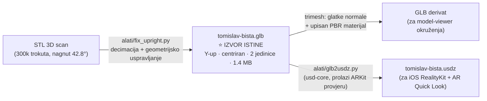
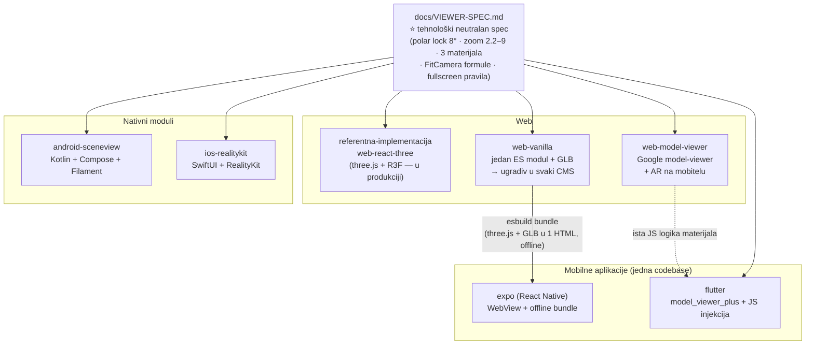
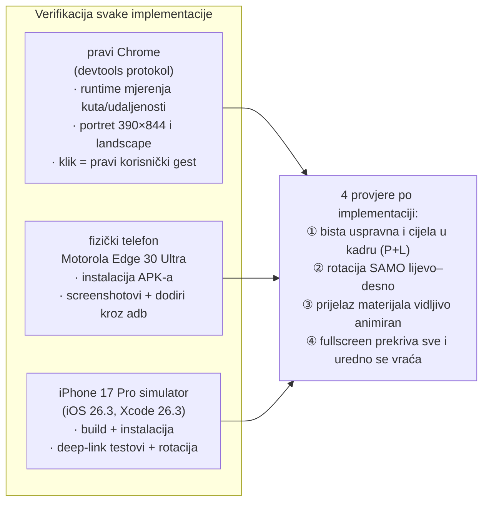
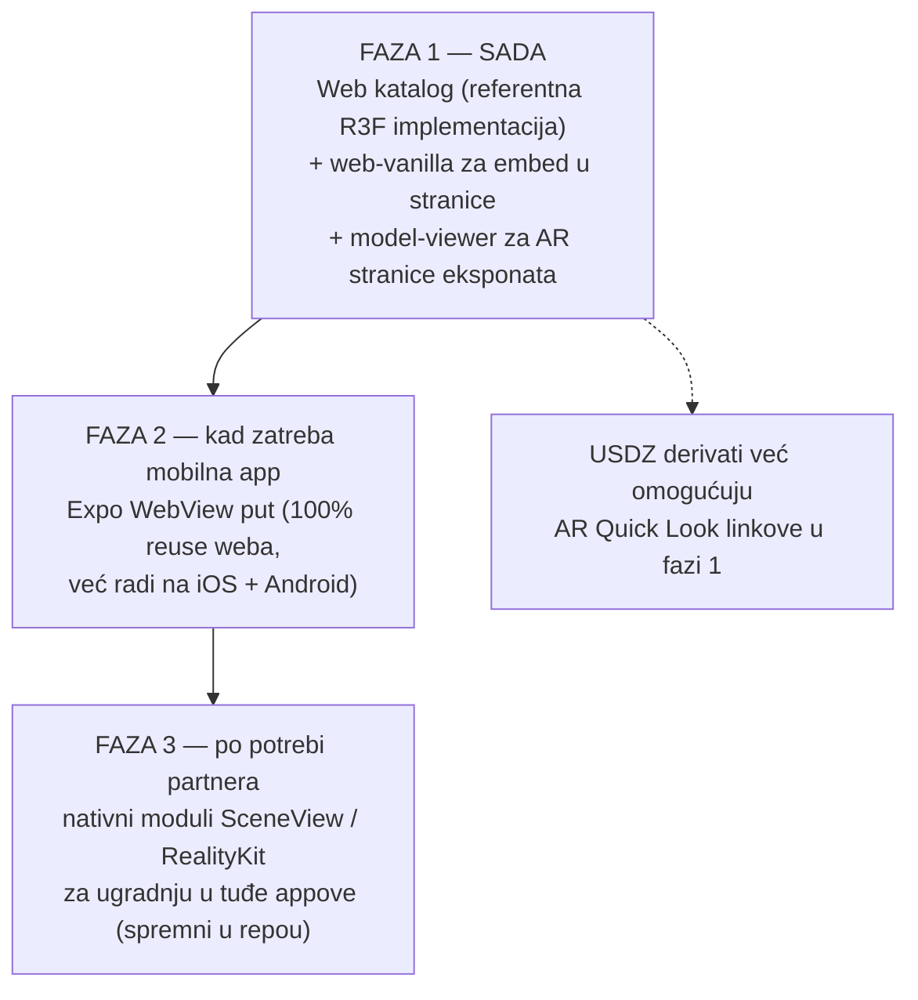

# Izvještaj: 3D viewer kulturne baštine u 6 tehnologija — sve dovršeno i verificirano

*Datum: 10. srpnja 2026. · Repozitorij: `stepanic/dbhz-3d-modeli` · Status: svih 6
planiranih implementacija dovršeno, testirano na stvarnim uređajima i objavljeno
u repozitoriju.*

## Sažetak za Družbu

Digitalni muzej DBHZ-a sada ima **kompletan, prenosiv 3D viewer** za pregled
modela kulturne baštine (prvi eksponat: bista kralja Tomislava) koji se ponaša
identično na **webu, u mobilnim aplikacijama (Expo/React Native i Flutter) te
nativno na Androidu i iPhoneu**. Svaka izvedba je doslovno *copy-paste* spremna
za ugradnju u postojeće stranice i aplikacije — od WordPress stranice do
nativne iOS app.

Ponašanje je svugdje isto, definirano jednim dokumentom
([VIEWER-SPEC](VIEWER-SPEC.md)): eksponat se okreće **samo oko vertikalne osi**
(kao na postolju u muzeju — ne može se okrenuti naglavačke), posjetitelj bira
**tri materijala** (bronca · brački kamen · bronca s patinom) s glatkim
animiranim prijelazom, model je **uvijek cijeli u kadru** (i pri rotaciji
ekrana), a **puni zaslon** radi pouzdano na svim platformama. Na mobitelima je
dostupan i **AR pregled** (model u stvarnom prostoru kroz kameru).

> ⚠️ Atribucija skulpture još **nije potvrđena** — do potvrde s Družbom model
> se u svim viewerima prikazuje s napomenom „ilustrativna 3D digitalizacija"
> (v. [`modeli/tomislav-bista/README.md`](../modeli/tomislav-bista/README.md)).

## 1. Od scana do eksponata — pipeline modela

Jedan izvorni GLB model pokreće sve implementacije; derivati se generiraju
automatski (skripte u repou):

## 2. Jedan spec, šest implementacija — tko što reusa

Ne portira se kod nego **specifikacija ponašanja** — a gdje god je moguće,
implementacije dijele stvarne artefakte:

Ključni odnosi:

- **`web-vanilla` je srce reusea** — Expo aplikacija ga bundla offline u
  WebView (100 % isto ponašanje na iOS/Android/web bez ijedne mrežne veze).
- **`web-model-viewer` i `flutter` dijele istu logiku** (Googleova
  `<model-viewer>` komponenta + identičan JS za animirani prijelaz materijala)
  i isti GLB derivat.
- **Nativni portovi (Android, iOS) dijele isti trik iz spec-a**: kamera je
  fiksna, a rotira se *model* — jednostavnije od orbit-kamere s ograničenjima,
  vizualno identično.

## 3. Kako je verificirano — mjerenja, ne dojmovi

Primjeri stvarnih mjerenja (ne screenshot-dojmova): polarni kut očitan iz
kamere = 82.0° i **ne da se promijeniti** (forsiranje na 20° → vraća se na
82°); prijelaz materijala uzorkovan svakih 120 ms pokazuje eksponencijalnu
rampu `0.78 → 0.44 → 0.25 → … → 0.02`; FitCamera udaljenost 5.57 (portret) →
3.48 (landscape); vertikalni swipe na fizičkom Androidu ne mijenja nagib pogleda.

## 4. Rezultat po implementaciji

| # | Implementacija | Tehnologija | Verificirano na | Za koga je |
|---|---|---|---|---|
| 0 | `referentna-implementacija/web-react-three` | Vite + React + three.js | u produkciji ([dbhz-prototip](https://dbhz-prototip.domovina.ai/?screen=bista)) | glavni web katalog |
| 1 | `implementacije/web-vanilla` | vanilla three.js ES modul | Chrome (mjerenja) | ugradnja u bilo koji CMS / statičku stranicu |
| 2 | `implementacije/web-model-viewer` | Google `<model-viewer>` | Chrome (mjerenja) | brze embed stranice s AR-om |
| 3 | `implementacije/expo` | React Native (WebView reuse) | Chrome + Motorola + iPhone sim. | mobilna app iz jedne codebase |
| 4 | `implementacije/flutter` | Flutter + model_viewer_plus | Chrome + Motorola + iPhone sim. | Flutter timovi |
| 5 | `implementacije/android-sceneview` | Kotlin + Compose + Filament | Motorola (fizički) | ugradnja u postojeće Android appove |
| 6 | `implementacije/ios-realitykit` | SwiftUI + RealityKit | iPhone simulator | ugradnja u postojeće iOS appove |

Svaka implementacija ima vlastiti README s uputama „kako pokrenuti" i
„kako ubaciti u postojeću aplikaciju" te dokumentirane platformske zamke
(ukupno 10-ak netrivijalnih, npr. Android release dozvole, gubitak osvjetljenja
na rotaciju iOS simulatora, Kotlin verzija za SceneView).

## 5. Preporuka smjera za digitalni muzej

**Web je glavna grana razvoja** — pokriva sve posjetitelje bez instalacije, a
sve tri web varijante dijele isti model. Novi eksponat se dodaje jednom
(`alati/fix_upright.py` → GLB u `modeli/`) i automatski radi u svim viewerima.

## 6. Gdje je što u repozitoriju

- [`docs/STATUS.md`](STATUS.md) — detaljna tablica: verzije, kako pokrenuti,
  kako je točno testirano, poznata ograničenja + završni izvještaj o trudu
- [`docs/VIEWER-SPEC.md`](VIEWER-SPEC.md) — spec ponašanja (izvor istine)
- [`docs/3d-bista-tehnicki-vodic.md`](3d-bista-tehnicki-vodic.md) — naučene lekcije
- `implementacije/<ime>/README.md` — upute po tehnologiji
