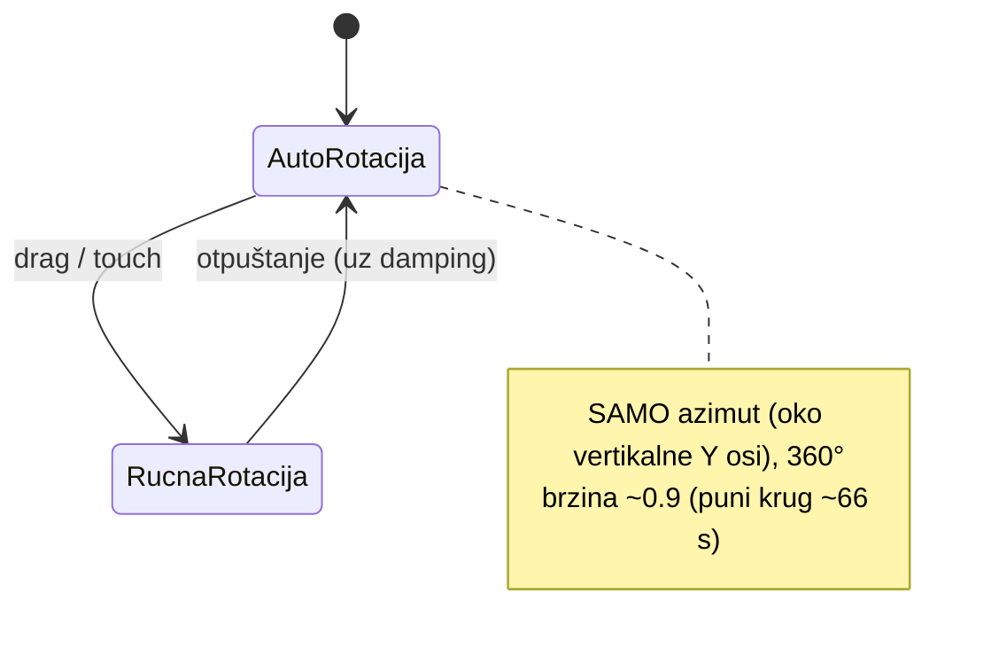
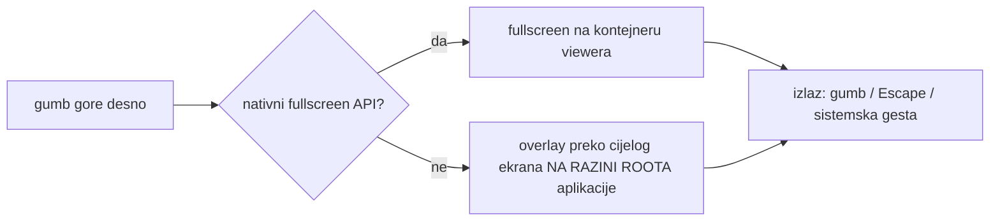

# VIEWER-SPEC — tehnološki neutralan spec 3D muzejskog viewera

**Ovo je dokument koji se portira.** Svaka implementacija (web, Expo, Flutter,
Kotlin, Swift) treba reproducirati OVO ponašanje — kod je sekundaran. Sve
vrijednosti su isprobane u referentnoj web implementaciji.

## 1. Ulazni model (ugovor o assetu)

- Format: **GLB** (glTF 2.0 binary), **bez tekstura i materijala** — materijal zadaje viewer.
- Orijentacija: **Y-up, uspravan** (garantira pipeline `alati/fix_upright.py`, ne viewer).
- Centriran na ishodište, najveća dimenzija normalizirana na **2.0 jedinice**.
- Ciljna veličina: ≤ 2 MB (decimacija na ~80k trokuta).
- Za iOS/AR Quick Look izvesti i **USDZ** derivat (GLB ostaje izvor istine).

## 2. Interakcija — rotacija „kao na stolu"



- **Polarni (vertikalni) kut pogleda je KONSTANTA**: 8° iznad horizonta
  (= 82° od zenita). Korisnik ga ne može promijeniti — pogled se ne može
  okrenuti naglavačke niti ispod postolja.
- **Pan je isključen.** Zoom dopušten: udaljenost 2.2 – 9 jedinica.
- Damping/inercija na rotaciji (prirodan osjećaj).
- Ekvivalentna alternativa na nativnim platformama: umjesto orbit-kamere s
  ograničenjima, **fiksiraj kameru i rotiraj MODEL oko njegove Y osi** — isti
  vizualni rezultat, često jednostavnije (RealityKit, SceneView).

## 3. Kadriranje (FitCamera)

Na svaku promjenu veličine viewporta (fullscreen, rotacija ekrana) udaljenost
kamere se postavlja tako da **cijeli model stane po visini i širini**:

```
rXZ   = hypot(dimX, dimZ) / 2      # horizontalni cirkumradius — invarijantan na azimut!
vTan  = tan(fovY / 2)              # fovY = 40°
hTan  = vTan * (širina / visina)
distW = rXZ * (1.2 / hTan + 1)     # fit širine na NAJBLIŽOJ plohi (perspektivna korekcija)
distV = 1.15 * halfH / vTan + 0.35 * rXZ
dist  = max(distV, distW)          # mijenja se SAMO udaljenost, ne smjer pogleda
```

Dvije zamke koje naivni bbox-fit ne pokriva: (1) model se vrti pa projicirana
širina doseže XZ **dijagonalu**; (2) perspektiva povećava dijelove bliže kameri.

## 4. Materijali — 3 varijante s animiranim prijelazom

Jedan PBR materijal (metallic-roughness); prijelaz se **animira** lerpanjem sva
tri parametra s eksponencijalnim prigušenjem: `k = 1 − e^(−4.5·dt)` (~1 s,
frame-rate neovisno). Animira se i karakter površine, ne samo boja.

| Varijanta | baseColor | metallic | roughness | Dojam |
|---|---|---|---|---|
| `bronca` (default) | `#b07d44` | 0.78 | 0.42 | sjajni brončani odljev |
| `kamen` | `#e9e4d3` | 0.02 | 0.93 | mat bijeli brački kamen |
| `patina` | `#5b9b82` | 0.28 | 0.74 | korodirana bronca (verdigris) |

UI: tri kružna swatcha (gore lijevo), aktivni ima bijeli rub + zlatni prsten
(`#D99E12`). Deep-link/parametar: `materijal=bronca|kamen|patina`.

## 5. Scena i osvjetljenje

- Pozadina: tamnozelena `#0c1c13` (DBHZ brand).
- Ambijentalno svjetlo intenziteta 0.55; ključno usmjereno svjetlo iz (4, 6, 5)
  intenziteta 1.6 (baca sjenu); dopunsko toplo `#ffe6b0` iz (−5, 2, −3) int. 0.5.
- Meka kontaktna sjena ispod modela (y ≈ −1.05), suptilna (opacity ~0.5).
- Kamera: perspektivna, fovY 40°.

## 6. Fullscreen



- Overlay **nikad ne smije biti `position:fixed` (ili ekvivalent) unutar dubine
  UI stabla** — predak s transformom/animacijom ga lomi (naučeno na iOS-u).
  Na webu: portal u `document.body`. Na nativnim platformama: modalni
  full-screen route/sheet.
- Ako overlay ima vlastitu instancu scene, 3D resurs se **klonira/instancira**
  (isti objekt ne smije biti u dva scene grapha).
- U fullscreenu se kadar odmah preračuna (poglavlje 3); scroll pozadine zaključan.

## 7. Katalog (muzejski kontekst)

- Svaki model nosi metapodatke: naziv, opis, izvor scana, autor/atribucija
  (s oznakom „potvrđeno / nepotvrđeno"), licenca, datum, povezani projekt DBHZ-a.
- Viewer je parametriziran URL-om/objektom modela — jedna implementacija, N modela.
- Sve UI kopije na hrvatskom.
